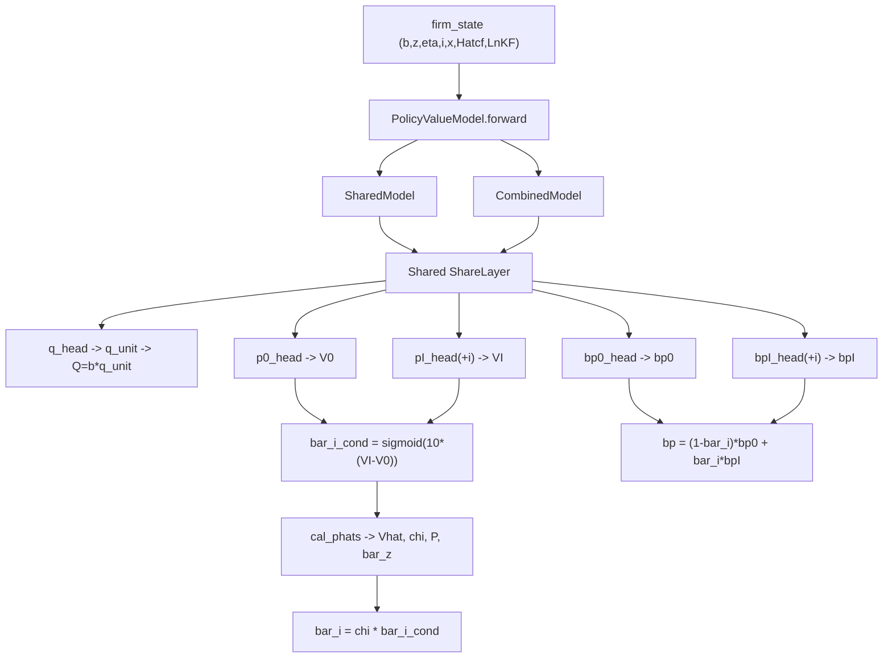
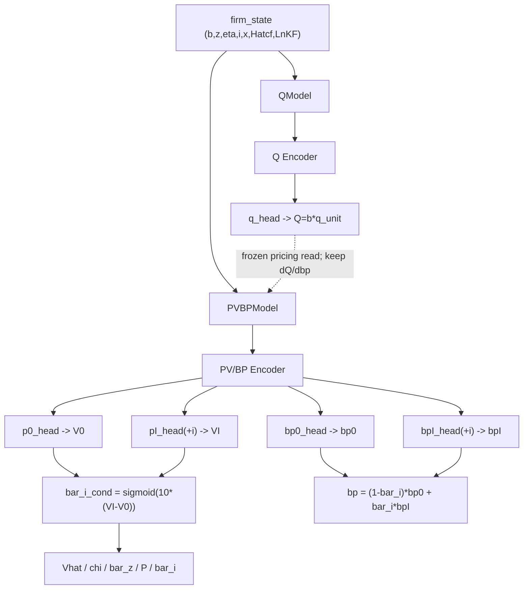

# Q / PV / BP 拆分重构清单

Date: 2026-03-30

## 1. 重构目标

当前 `PolicyValueModel` 将：

- `Q`
- `bp0 / bpI`
- `V0 / VI / bar_i_cond`

放在同一个总模型中，并通过同一个 `ShareLayer` 共享底层表征。

这与当前确认的对象划分不一致：

- `Q`：旧债价格对象，只负责给 parent 当前存量债定价
- `bp0 / bpI / V0 / VI / bar_i_cond`：股权侧 policy / value block

因此本次重构目标是：

1. 将 `Q` 从 `bp / P / V` 的共享路径中拆出
2. 让 `Q` 单独训练
3. 让 `bp + P/V` 一起训练
4. 保留 `PV` 训练时对固定 `Q` 的读取，以及 `dQ/dbp` 对 `bp` 的梯度通道
5. 禁止 `P0 / PI / bp` 反向更新 `Q` 参数

---

## 2. 当前问题定位

### 2.1 当前模型结构问题

当前 `PolicyValueModel` 在

- `models/policy_value.py`
- `models/share_layer.py`

中采用：

```text
一个 ShareLayer
-> SharedModel(Q, bp0, bpI)
-> CombinedModel(V0, VI, bar_i_cond)
```

这意味着：

- `Q` 与 `bp0 / bpI` 共用 trunk
- `Q` 与 `V0 / VI` 也共用 trunk

所以即便后续不显式加 `q_loss`，
`P0 / PI` 的训练也会继续污染 `Q` 的底层表示。

---

### 2.2 当前训练调度问题

当前 `_run_batches()` 的 policy 路径是：

```text
前 q_only_epochs:
    只训 q
之后:
    同时训 p0 + pi + q
```

这不是目标设计。

目标设计应为：

```text
Stage A:
    只训 Q
Stage B:
    冻结 Q，只训 bp + P/V
```

必要时再做外层 alternating，而不是一步内 joint backward。

---

### 2.3 当前优化器问题

当前 `build_optimizers()` 中 `policy_value` 只有一个 AdamW：

```text
optimizer(policy_value.parameters())
```

这不支持：

- `Q` 参数单独更新
- `PV/BP` 参数单独更新
- 两组参数使用不同 LR / weight decay / scheduler

---

## 3. 当前架构图



当前最核心的问题就是只有一个共享 encoder。

这意味着：

- `Q` 与 `bp0 / bpI` 共用 encoder
- `Q` 与 `V0 / VI` 也共用 encoder
- 即使只训练 `P0 / PI`，也会改动 `Q` 的底层表示

---

## 4. 目标结构

### 3.1 模型拆分

应拆成两个主模型：

#### A. `QModel`

职责：

- 输入 state
- 输出 `Q`
- 可选输出 `q_unit`

内部结构：

- `QShareLayer`
- `QHead`

不再输出：

- `bp0`
- `bpI`
- `V0`
- `VI`

#### B. `PVBPModel`

职责：

- 输出 `V0`
- 输出 `VI`
- 输出 `bar_i_cond`
- 输出 `bp0`
- 输出 `bpI`
- 派生 `Vhat / chi / bar_z / P / bar_i / bp`

内部结构：

- `PVBPShareLayer`
- `P0Head`
- `PIHead`
- `BP0Head`
- `BPIHead`

不再输出：

- `Q`

---

### 3.2 派生对象归属

以下对象应保留在 `PVBPModel` 中派生：

- `Vhat`
- `chi`
- `bar_z`
- `P`
- `bar_i`
- `bp`

原因：

- 它们都属于 equity / survival / decision block
- 不应再与 `Q` 混在同一 trunk 中训练

---

### 4.3 目标架构图



目标结构要求：

- `Q` encoder 与 `PV/BP` encoder 物理分离
- `PV/BP` 训练时可以读取冻结 `Q`
- `bp` 的梯度仍可通过固定 `QModel` 传播
- `QModel` 参数不再被 `P0 / PI / bp` 更新

---

## 5. 文件级重构清单

### 5.1 `models/share_layer.py`

#### 需要新增

1. `QSharedModel`
   - 仅包含：
     - `share_layer`
     - `q_head`

2. `PVBPSharedModel`
   - 包含：
     - `share_layer`
     - `bp0_head`
     - `bpI_head`
     - `p0_head`
     - `pI_head`

#### 需要删除或弃用

- 旧的 `SharedModel(Q, bp0, bpI)`
- 旧的 `CombinedModel(V0, VI, bar_i_cond)` 与其共享 trunk 的耦合方式

#### 目标结果

`Q` 的 encoder 与 `bp/P/V` 的 encoder 完全分离。

---

### 5.2 `models/policy_value.py`

#### 需要调整

将当前 `PolicyValueModel` 拆成两个类：

1. `QModel`
2. `PVBPModel`

可选保留一个组合 wrapper，例如：

3. `PolicyValueSystem`

职责：

- 组合 `q_model`
- 组合 `pvbp_model`
- 对外提供统一 helper

但注意：

- wrapper 只负责调用，不再代表“一个共享 trunk 的总模型”

#### `PVBPModel.forward(...)`

应返回：

- `bp0`
- `bpI`
- `V0`
- `VI`
- `bar_i_cond`
- `Vhat`
- `chi`
- `bar_z`
- `P`
- `bar_i`
- `bp`

#### `QModel.forward(...)`

应只返回：

- `Q`

必要时再提供：

- `get_q_unit(...)`

---

#### 5.2.1 Checkpoint 兼容性

这次重构后，旧的 `policy_value` checkpoint 很可能不再直接兼容。

原因：

- 旧版 `state_dict` 结构是：
  - `shared_model.*`
  - `combined_model.*`
- 新版会变成：
  - `q_model.*`
  - `pvbp_model.*`

因此需要明确迁移策略：

1. 默认认为旧 ckpt 不可直接恢复训练
2. 加载旧 ckpt 时给出明确提示，而不是静默部分失配
3. 新版 ckpt 应分别保存：
   - `*_policy_value_q.pt`
   - `*_policy_value_pvbp.pt`
   - 可选再保存一个 wrapper 聚合 ckpt 仅用于推理兼容

如果后续需要旧权重迁移，应单独写一次性 mapping script，而不是在主训练路径里隐式兼容。

---

### 5.3 `experiments/run_utils.py`

#### `build_models(...)`

当前：

```text
"policy_value": PolicyValueModel()
```

需要改为：

```text
"q_model": QModel()
"pvbp_model": PVBPModel()
```

若保留 wrapper，则：

```text
"policy_value_system": PolicyValueSystem(q_model, pvbp_model)
```

但训练入口必须能区分：

- Q 参数
- PV/BP 参数

#### `build_optimizers(...)`

需要拆成至少两个 optimizer：

1. `optimizer_q`
2. `optimizer_pvbp`

建议支持：

- 不同学习率
- 不同 weight decay
- 不同 scheduler

---

### 4.4 `training/episode.py`

这是本次改动最大的文件。

#### A. `train_step(...)`

当前逻辑：

- `train_modules=['policy_value']`
- `policy_loss_terms=['p0','pi','q']`

需要改成对象化阶段控制：

```text
train_modules=['q_model']
or
train_modules=['pvbp_model']
```

不要再用“同一个 model + 不同 loss terms”的方式模拟拆分。

#### B. `_set_policy_q_only_freeze(...)`

当前是：

- 冻结 `PolicyValueModel` 中非 Q 参数
- 但可能仍放开 shared layer

重构后应删除或大幅简化，因为：

- `QModel` 本身就是独立模型
- 不再需要在同一个模型内部做 requires_grad 切换

#### C. `_set_policy_bp_only_freeze(...)`

当前只冻结到 `bp0/bpI` 头，但仍在同一个大模型里。

重构后应删除或改成：

- `PVBPModel` 内部可选的“仅 bp 头精修”

这属于次级优化，不是主结构。

#### D. `_compute_q_loss(...)`

需要改成只读取：

- `q_model`

并且在需要 `bar_i / bar_z` 时，从冻结的 `pvbp_model` 提供辅助量：

- `bar_i_use`
- `bar_z_use`

注意：

- 这些辅助量对 `QModel` 训练不应反向更新 `PVBPModel`
- 最稳妥的做法是 `with torch.no_grad()` 或显式 `detach`

#### E. `_compute_p0_loss(...)` / `_compute_pi_loss(...)`

需要改成：

- `Q` 来自冻结的 `q_model`
- `Qp / QpI` 也来自冻结的 `q_model`
- `P0 / PI / bp0 / bpI / P / bar_z / bar_i` 来自 `pvbp_model`

关键要求：

- `QModel` 参数冻结
- 但 `Q(bp)` 对 `bp` 的导数必须保留，以支持 FOC

因此这里不能简单用：

```python
Qp = q_model(state).detach()
```

否则 `dQ/dbp` 会被切断。

正确做法应是：

```text
冻结 q_model.parameters() 的 requires_grad
但保持输入 state / bp 仍可求导
```

这样：

- 梯度能传回 `bp`
- 但不会更新 `QModel` 参数

#### F. `_run_batches(...)`

当前：

```text
q_only -> joint(p0,pi,q)
```

需要改成：

```text
if epoch < q_stage_epochs:
    train q_model only
else:
    train pvbp_model only
```

可选支持第三阶段：

```text
alternating:
    q_model for k epochs
    pvbp_model for m epochs
```

但不应恢复一步内 joint backward。

---

### 4.5 `data/sample.py` / `data/simulate_ts.py` / `data/simulate_ts_parallel.py`

需要检查并改所有直接读取 `models['policy_value']` 的地方。

目标改为：

- 需要债券价格时读 `q_model`
- 需要 value / policy 时读 `pvbp_model`

若调用点很多，可临时保留一个系统 wrapper 适配旧接口。

---

### 4.6 `experiments/run_multi_episode_job.py`

#### CLI 阶段控制需要改

建议新增：

- `--q-stage-epochs`
- `--pvbp-stage-epochs`
- `--alt-rounds`（可选）

弃用“q-only 后自动 joint”的描述。

#### artifact 输出需要改

现在 stage tag 可以保留，但名称应更准确：

- `q_stage_end`
- `pvbp_stage_end`

而不是：

- `joint_end`

因为你现在的目标设计已经不再是 joint。

---

## 5. 训练阶段设计

### Stage A: Q Stage

训练：

- `QModel`

冻结：

- `PVBPModel`

输入辅助量：

- `bar_i`
- `bar_z`

来源：

- 冻结的 `PVBPModel`

要求：

- `Q` 只学习 old debt pricing object
- 不让 `bp / P / V` 反向污染 `Q`

---

### Stage B: PV+BP Stage

训练：

- `PVBPModel`

冻结：

- `QModel`

读取：

- `Q`
- `Qp`
- `QpI`

来源：

- 冻结的 `QModel`

要求：

- 保留 `Q(bp)` 对 `bp` 的梯度
- 但禁止更新 `QModel` 参数

---

### Stage C: 可选 Alternating

如果后面发现：

- `Q` 需要根据新的 `bar_i / bar_z` 微调
- 或 `PV/BP` 对既有 `Q` 适配不足

则做外层 alternating：

```text
Round 1:
    Q stage
Round 2:
    PV+BP stage
Round 3:
    Q stage
...
```

不建议做：

```text
同一步里 p0 + pi + q 一起 backward
```

---

## 6. 重构优先级

### Priority 1

先完成结构分离：

1. 拆模型
2. 拆 optimizer
3. 拆训练阶段

这是必须先做的。

### Priority 2

再修调用链：

1. `episode.py`
2. `sample/simulate`
3. `run_utils`

### Priority 3

最后修实验和诊断口径：

1. 命令行参数
2. artifact 命名
3. 诊断图标题与说明

---

## 7. 最小可落地版本

如果不想一次性大改全部代码，可以按最小版本推进：

1. 保留现有 `PolicyValueModel` 作为兼容 wrapper
2. 但 wrapper 内部改成：
   - `self.q_model`
   - `self.pvbp_model`
3. 所有训练函数不再直接更新 wrapper 全参数，而是只更新其中一块
4. 先把训练层和 optimizer 层拆开
5. 等稳定后再删除旧共享结构

这样可以降低一次性重构风险。

---

## 8. 最终目标状态

重构完成后，应达到：

1. `Q` 与 `PV/BP` 不再共享 trunk
2. `Q` 单独训练
3. `bp + P/V` 一起训练
4. `PV/BP` 可读取固定 `Q`
5. `dQ/dbp` 可进入 `bp` 的 FOC
6. `P0 / PI / bp` 不能再更新 `Q` 参数
7. 训练日志和 artifact 明确显示当前阶段是：
   - `q_stage`
   - `pvbp_stage`

---

## 9. 一句话版本

这次重构的核心不是“再调联合训练顺序”，而是：

```text
把 Q 从共享 trunk 中物理拆出来，
让 Q 只做 pricing，
让 bp + P/V 只做 equity-side decision。
```
